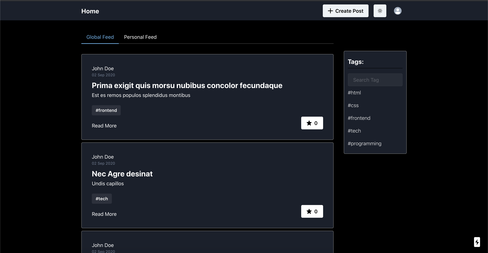
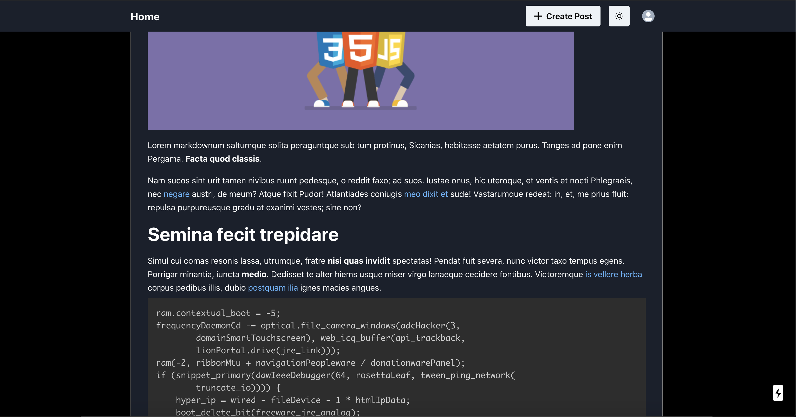
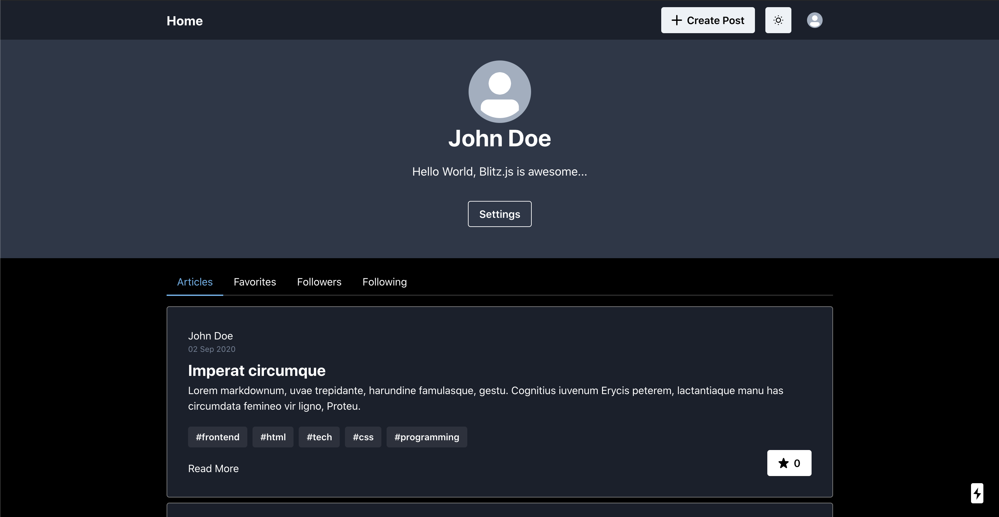

[](https://blitzjs.com)

# Blitz.js Realworld App

Content sharing app built with [Blitz.js](https://github.com/blitz-js/blitz)

### [Demo](https://blitzjs-realworld-app.vercel.app/)

Note: You might get `Error in connector: Error querying the database: db error: FATAL: too many connections for role` error while using the demo app. This happens because it uses the free tier postgresql database on [Heroku](https://heroku.com) which does not support connection pooling and since the generated API's are serverless functions that run on [Vercel](https://vercel.com) and each function is being executed in a separate process, the db runs out of the available connections very quickly.

### Inspiration:

The app is built as a part of exploring [Blitz.js](https://github.com/blitz-js/blitz) and is heavely inspired by [gothinkster's realworld app](https://github.com/gothinkster/realworld) and [Dev.to](https://dev.to) platform.

### Features:

- User authentication
- User Settings
- User following
- Creating and managing posts with markdown
- Commenting on posts
- Add posts to favorites

### Previews:

##### Posts Feed



##### Post View



##### User Profile



### Tech Stack:

- [Blitz.js](https://blitzjs.com/)
- [React](https://reactjs.org/)
- [Next](https://nextjs.org/)
- [Prisma 2](https://www.prisma.io/)
- [TypeScript](https://www.typescriptlang.org/)
- [Chakra UI](https://chakra-ui.com/)
- [PostgreSQL](https://www.postgresql.org/)

### Todo:

- Support recursive comments (reply on individual comment)
- Comment Likes
- Change user password

## Getting Started

Run your app in the development mode.

```
# run db migrations:
blitz db migrate

# start the dev server
blitz start
```

Open [http://localhost:3000](http://localhost:3000) with your browser to see the result.
